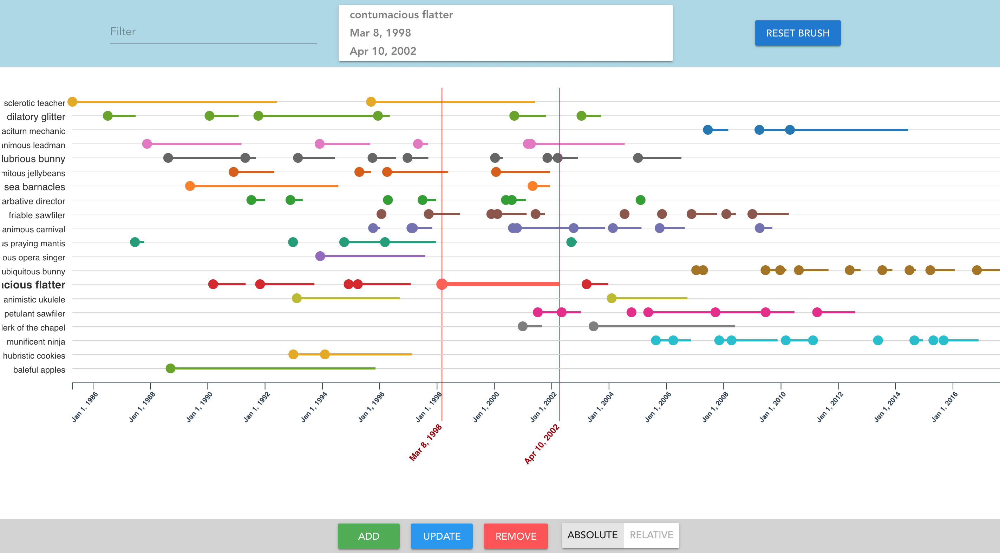
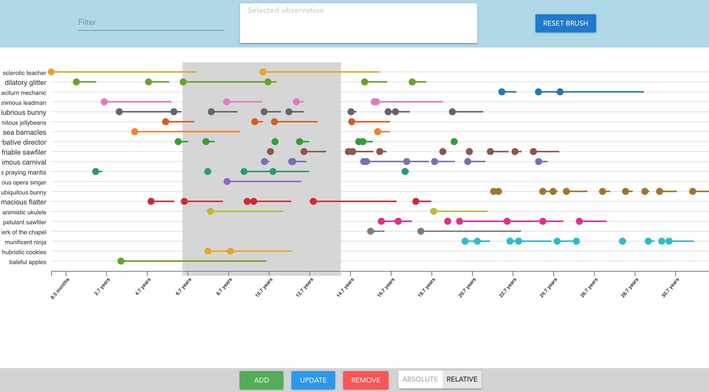

# Timelines
Conceptual implementation of a variant of timeline visualisation

- vue
- vue-cli 3
- vuetify
- d3
- typescript



<br>

<br>
<a href="https://beaugogh.github.io/data-visualizations/timelines/dist/" target="_blank">demo</a>


### Install vue-cli 3

`npm install -g @vue/cli` or `yarn global add @vue/cli`

### Project setup

```
yarn
```

### Compiles and hot-reloads for development

```
yarn serve
```

### Compiles and minifies for production

```
yarn build:prod
```

### Compiles for development

```
yarn build
```

### Lints and fixes files

```
yarn lint
```

### Customize configuration

See [Configuration Reference](https://cli.vuejs.org/config/).
